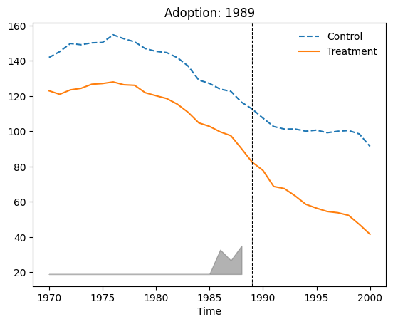
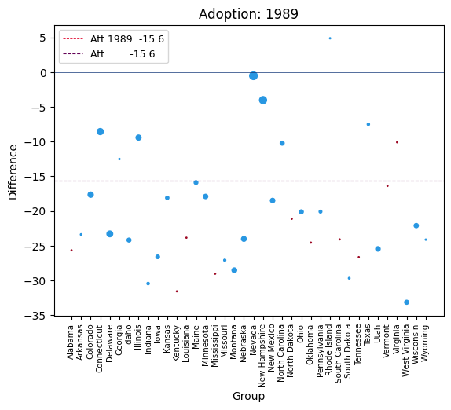
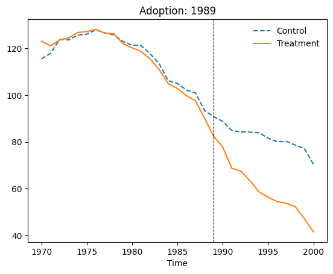
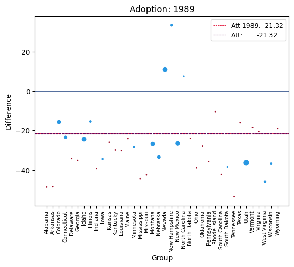
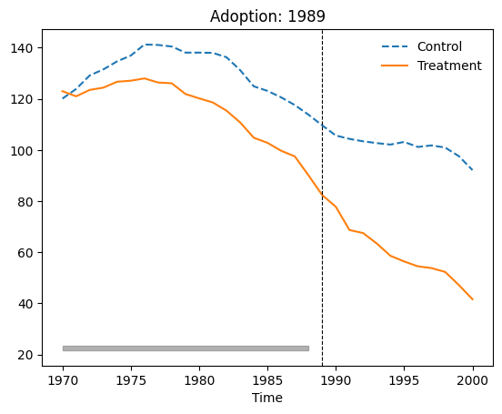
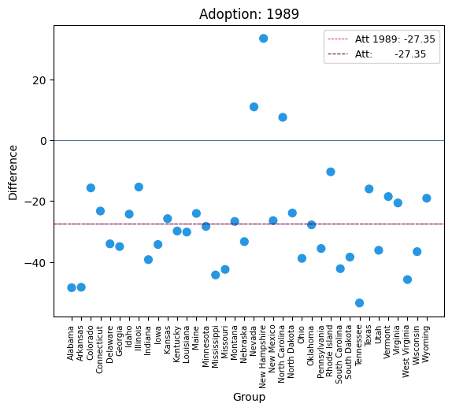

# sythdid: Synthetic Difference in Difference Estimation

This package implements the synthetic difference-in-differences estimation procedure, along with a range of inference and graphing procedures, following the work of the author. The package draws on [R](https://github.com/synth-inference/synthdid) and [Julia](https://github.com/d2cml-ai/Synthdid.jl) code for optimization and [Stata](https://github.com/Daniel-Pailanir/sdid) code for implementation in contexts with staggered adoption over multiple treatment periods (as well as in a single adoption period as in the original code). The package extends the functionality of the original code, allowing for estimation in a wider range of contexts. Overall, this package provides a comprehensive toolkit for researchers interested in using the synthetic difference-in-differences estimator in their work.


## Instalation

```py
pip install synthdid
```

## Usage

### Input class `Synthdid`

- `outcome`: Outcome variable (numeric)
- `unit`: Unit variable (numeric or string)
- `time`: Time variable (numeric)
- `quota`: Dummy of treatement, equal to 1 if units are treated, and otherwise 0 (numeric)

### Methods:

- `.fit(cov_method: Literal["optimized", "projected"] | None)`: Estimates the ATE, as well as the time and unit weights. Can use covariates and fit them with the method specified in `cov_method`
- `.vcov(method: Literal["placebo", "bootstrap", "jackknife"], n_reps:int = 50)`: Estimates the standard error of the ATE estimator

## Examples Based on Empirical Application

```python
from synthdid.get_data import california_prop99, quota
from synthdid.synthdid import Synthdid
from matplotlib import pyplot as plt
import numpy as np
```

### Block Design

```python
df = california_prop99()
california_sdid = Synthdid(df, "State", "Year", "treated", "PacksPerCapita").fit().vcov().summary()
california_sdid.summary2
```

| |ATT      |Std. Err.|t        |P > \|t\|
|-|---------|---------|---------|--------|
|0|-15.60383|10.789924|-1.446148|0.148136|

```python
plt.show(california_sdid.plot_outcomes())
plt.show(california_sdid.plot_weights())
```






```python
california_did = Synthdid(df, "State", "Year", "treated", "PacksPerCapita").fit(synth = True)
plt.show(california_sc.plot_outcomes())
plt.show(california_sc.plot_weights())
```





```python
california_did = Synthdid(df, "State", "Year", "treated", "PacksPerCapita").fit(did = True)
plt.show(california_did.plot_outcomes())
plt.show(california_did.plot_weights())
```





### Staggered Adoptions Design

```python
df = quota()
fit_model = Synthdid(df, "country", "year", "quota", "womparl").fit().vcov().summary()
fit_model.summary2
```

| |ATT      |Std. Err.|t        |P > \|t\|
|-|---------|---------|---------|--------|
|0|8.0341   |1.684382 |4.769762 |0.000002|

```python
fit_model.att_info
```

| |time  |att_time |att_wt  |N0 |T0|N1|T1|
|-|------|---------|--------|---|--|--|--|
|0|2000.0|8.388868 |0.170213|110|10|1 |16|
|1|2002.0|6.967746 |0.297872|110|12|2 |14|
|2|2003.0|13.952256|0.276596|110|13|2 |13|
|3|2005.0|-3.450543|0.117021|110|15|1 |11|
|4|2010.0|2.749035 |0.063830|110|20|1 |6 |
|5|2012.0|21.762715|0.042553|110|22|1 |4 |
|6|2013.0|-0.820324|0.031915|110|23|1 |3 |

```python
fit_covar_model = Synthdid(df[~df.lngdp.isnull()], "country", "year", "quota", "womparl", covariates = ["lngdp"]).fit().vcov(method = "bootstrap").summary()
fit_covar_model.summary2
```

| |ATT      |Std. Err.|t        |P > \|t\|
|-|---------|---------|---------|--------|
|0|8.04901  |3.395295 |2.370636 |0.017757|

```python
fit_covar_model_projected = Synthdid(df[~df.lngdp.isnull()], "country", "year", "quota", "womparl", covariates = ["lngdp"]).fit(cov_method = "projected").vcov(method = "bootstrap").summary()
fit_covar_model_projected.summary2
```

| |ATT      |Std. Err.|t        |P > \|t\|
|-|---------|---------|---------|--------|
|0|8.05903  |3.428897 |2.350327 |0.018757|

### Inference Options

```python
countries_for_excluding = ["Algeria", "Kenya", "Samoa", "Swaziland", "Tanzania"]
se_examples = Synthdid(
        df[~df.country.isin(countries_for_excluding)],
        "country",
        "year",
        "quota",
        "womparl"
).fit().vcov(method = "bootstrap").summary()
se_examples.summary2
```

| |ATT      |Std. Err.|t        |P > \|t\|
|-|---------|---------|---------|--------|
|0|10.33066 |5.404923 |1.911343 |0.055961|

```python
se_examples.vcov(method = "placebo").summary()
se_examples.summary2
```

| |ATT      |Std. Err.|t        |P > \|t\|
|-|---------|---------|---------|--------|
|0|10.33066 |2.244618 |4.602413 |0.000004|

```python
se_examples.vcov(method = "jackknife").summary()
se_examples.summary2
```

| |ATT      |Std. Err.|t        |P > \|t\|
|-|---------|---------|---------|--------|
|0|10.33066 |6.04213  |1.709771 |0.087308|

