# sythdid: Synthetic Difference in Difference Estimation

This package implements the synthetic difference-in-differences estimation procedure, along with a range of inference and graphing procedures, following the work of the author. The package draws on [R](https://github.com/synth-inference/synthdid) and [Julia](https://github.com/d2cml-ai/Synthdid.jl) code for optimization and [Stata](https://github.com/Daniel-Pailanir/sdid) code for implementation in contexts with staggered adoption over multiple treatment periods (as well as in a single adoption period as in the original code). The package extends the functionality of the original code, allowing for estimation in a wider range of contexts. Overall, this package provides a comprehensive toolkit for researchers interested in using the synthetic difference-in-differences estimator in their work.


## Instalation

```py
pip install synthdid
```

## Usage

### Class input `Synthdid`

- `outcome`: Outcome variable (numeric)
- `unit`: Unit variable (numeric or string)
- `time`: Time variable (numeric)
- `quota`: Dummy of treatement, equal to 1 if units are treated, and otherwise 0 (numeric)

### Methods:

- `.fit(cov_method = ["optimized", "projected"])`
- `.vcov(method = ["placebo", "bootstrap", "jackknife"], n_reps:int = 50)`

## Example

### California 


```python
import matplotlib.pyplot as plt
import numpy as np, pandas as pd

from synthdid.synthdid import Synthdid as sdid
from synthdid.get_data import quota, california_prop99
pd.options.display.float_format = '{:.4f}'.format
```

Estimations with Standard Variance-Covariance Estimation


```python
california_estimate = sdid(california_prop99(), unit="State", time="Year", treatment="treated", outcome="PacksPerCapita").fit().vcov(method='placebo')
california_estimate.summary().summary2
```


<div>
<style scoped>
    .dataframe tbody tr th:only-of-type {
        vertical-align: middle;
    }

    .dataframe tbody tr th {
        vertical-align: top;
    }

    .dataframe thead th {
        text-align: right;
    }
</style>
<table border="1" class="dataframe">
  <thead>
    <tr style="text-align: right;">
      <th></th>
      <th>ATT</th>
      <th>Std. Err.</th>
      <th>t</th>
      <th>P&gt;|t|</th>
    </tr>
  </thead>
  <tbody>
    <tr>
      <th>0</th>
      <td>-15.6038</td>
      <td>9.5733</td>
      <td>-1.6299</td>
      <td>0.1031</td>
    </tr>
  </tbody>
</table>
</div>


Estimations without Standard Variance-Covariance Estimation


```python
california_estimate = sdid(california_prop99(), "State", "Year", "treated", "PacksPerCapita").fit()
california_estimate.summary().summary2
```


<div>
<style scoped>
    .dataframe tbody tr th:only-of-type {
        vertical-align: middle;
    }

    .dataframe tbody tr th {
        vertical-align: top;
    }

    .dataframe thead th {
        text-align: right;
    }
</style>
<table border="1" class="dataframe">
  <thead>
    <tr style="text-align: right;">
      <th></th>
      <th>ATT</th>
      <th>Std. Err.</th>
      <th>t</th>
      <th>P&gt;|t|</th>
    </tr>
  </thead>
  <tbody>
    <tr>
      <th>0</th>
      <td>-15.6038</td>
      <td>-</td>
      <td>-</td>
      <td>-</td>
    </tr>
  </tbody>
</table>
</div>


#### Plots


```python
california_estimate.plot_outcomes();
```


    
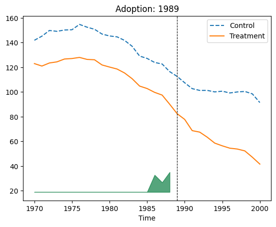
    


```python
california_estimate.plot_weights()
```

    d:\work\synthdid.py\synthdid\plots.py:136: UserWarning: FixedFormatter should only be used together with FixedLocator
      ax.set_xticklabels(units, rotation = 90, fontsize = ns);
    


    <synthdid.synthdid.Synthdid at 0x247c18bd340>


    

    


## Quota


```python
quota_estimate = sdid(quota(), "country", "year", "quota", "womparl").fit()

```


```python
quota_estimate.vcov().summary().summary2 ## placebo 
```


<div>
<style scoped>
    .dataframe tbody tr th:only-of-type {
        vertical-align: middle;
    }

    .dataframe tbody tr th {
        vertical-align: top;
    }

    .dataframe thead th {
        text-align: right;
    }
</style>
<table border="1" class="dataframe">
  <thead>
    <tr style="text-align: right;">
      <th></th>
      <th>ATT</th>
      <th>Std. Err.</th>
      <th>t</th>
      <th>P&gt;|t|</th>
    </tr>
  </thead>
  <tbody>
    <tr>
      <th>0</th>
      <td>8.0341</td>
      <td>1.9112</td>
      <td>4.2037</td>
      <td>0.0000</td>
    </tr>
  </tbody>
</table>
</div>


#### With covariates


```python

quota_cov = quota().dropna(subset="lngdp")
quota_cov_est = sdid(quota_cov, "country", 'year', 'quota', 'womparl', covariates=['lngdp']).fit()
quota_cov_est.summary().summary2
```


<div>
<style scoped>
    .dataframe tbody tr th:only-of-type {
        vertical-align: middle;
    }

    .dataframe tbody tr th {
        vertical-align: top;
    }

    .dataframe thead th {
        text-align: right;
    }
</style>
<table border="1" class="dataframe">
  <thead>
    <tr style="text-align: right;">
      <th></th>
      <th>ATT</th>
      <th>Std. Err.</th>
      <th>t</th>
      <th>P&gt;|t|</th>
    </tr>
  </thead>
  <tbody>
    <tr>
      <th>0</th>
      <td>8.0490</td>
      <td>-</td>
      <td>-</td>
      <td>-</td>
    </tr>
  </tbody>
</table>
</div>


Covariable method = 'projected'


```python
quota_cov_est.fit(cov_method="projected").summary().summary2
```


<div>
<style scoped>
    .dataframe tbody tr th:only-of-type {
        vertical-align: middle;
    }

    .dataframe tbody tr th {
        vertical-align: top;
    }

    .dataframe thead th {
        text-align: right;
    }
</style>
<table border="1" class="dataframe">
  <thead>
    <tr style="text-align: right;">
      <th></th>
      <th>ATT</th>
      <th>Std. Err.</th>
      <th>t</th>
      <th>P&gt;|t|</th>
    </tr>
  </thead>
  <tbody>
    <tr>
      <th>0</th>
      <td>8.0590</td>
      <td>-</td>
      <td>-</td>
      <td>-</td>
    </tr>
  </tbody>
</table>
</div>


```python
quota_cov_est.plot_outcomes()
```


    <synthdid.synthdid.Synthdid at 0x247f469aeb0>


    
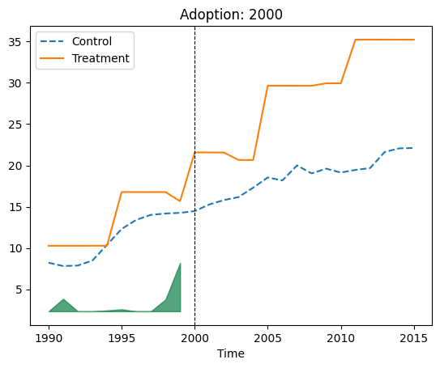
    


    
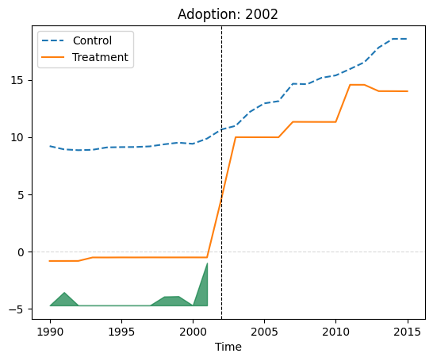
    


    
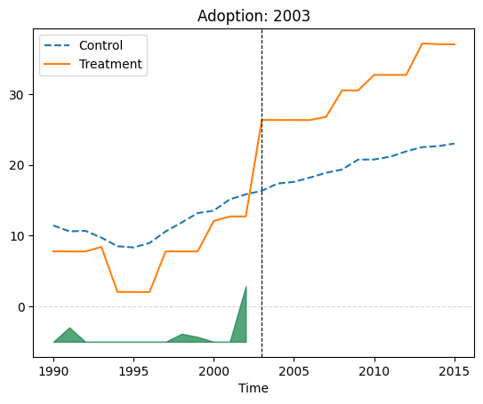
    


    
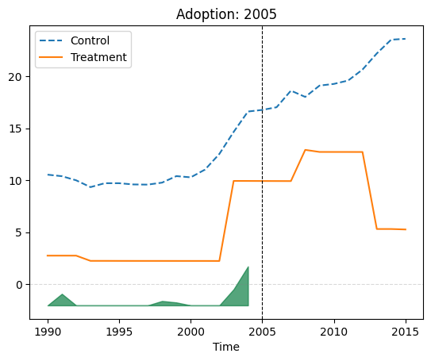
    


    
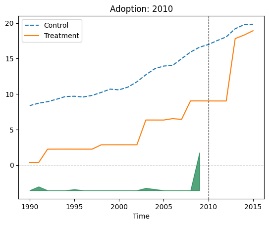
    


    
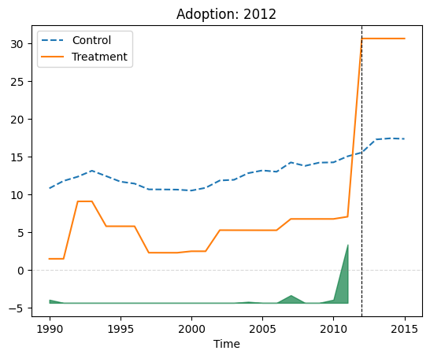
    


    
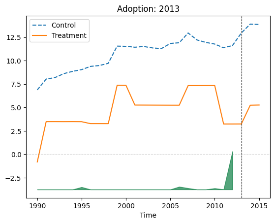
    


```python
quota_cov_est.plot_weights()
```

    d:\work\synthdid.py\synthdid\plots.py:136: UserWarning: FixedFormatter should only be used together with FixedLocator
      ax.set_xticklabels(units, rotation = 90, fontsize = ns);
    d:\work\synthdid.py\synthdid\plots.py:136: UserWarning: FixedFormatter should only be used together with FixedLocator
      ax.set_xticklabels(units, rotation = 90, fontsize = ns);
    d:\work\synthdid.py\synthdid\plots.py:136: UserWarning: FixedFormatter should only be used together with FixedLocator
      ax.set_xticklabels(units, rotation = 90, fontsize = ns);
    d:\work\synthdid.py\synthdid\plots.py:136: UserWarning: FixedFormatter should only be used together with FixedLocator
      ax.set_xticklabels(units, rotation = 90, fontsize = ns);
    d:\work\synthdid.py\synthdid\plots.py:136: UserWarning: FixedFormatter should only be used together with FixedLocator
      ax.set_xticklabels(units, rotation = 90, fontsize = ns);
    d:\work\synthdid.py\synthdid\plots.py:136: UserWarning: FixedFormatter should only be used together with FixedLocator
      ax.set_xticklabels(units, rotation = 90, fontsize = ns);
    d:\work\synthdid.py\synthdid\plots.py:136: UserWarning: FixedFormatter should only be used together with FixedLocator
      ax.set_xticklabels(units, rotation = 90, fontsize = ns);
    


    <synthdid.synthdid.Synthdid at 0x247f469aeb0>


    

    


    

    


    
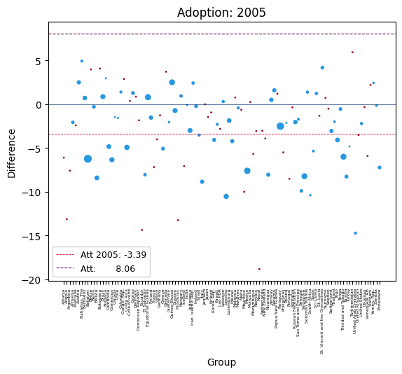
    


    
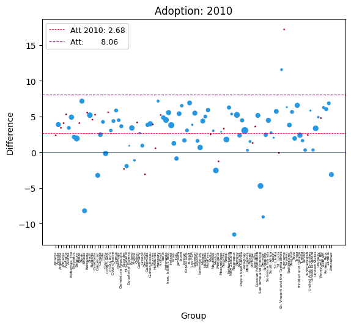
    


    
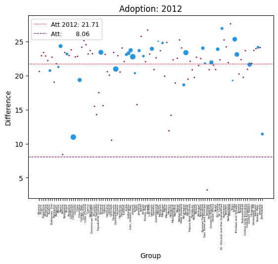
    


    

    


    
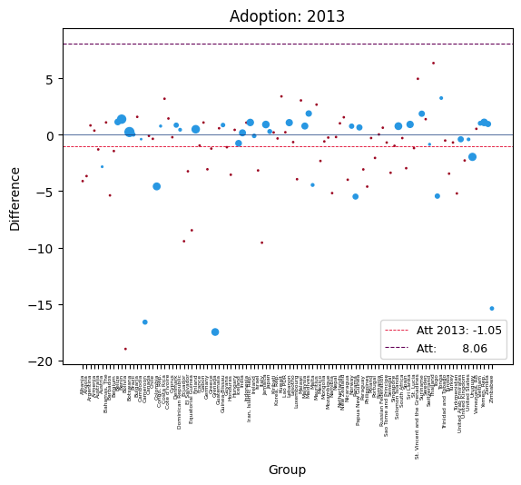
    

